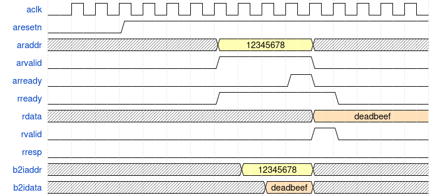

# custom_ip_with_litex

> The goal of this repository is to show how to integrate a custom IP written in Verilog in a LiteX-based SoC design

> Many thanks to [Tianxu Li](https://labsticc.fr/en/directory/li-tianxu) for his help with the design of the AXI-lite read/write logic.

## Requirements

- This tutorial has been tested on Nexys4DDR and ZCU104 boards with Vivado 2024.2. It should work with other boards as long as it is supported by LiteX. This tutorial uses the Nexys4DDR default LiteX script: https://github.com/litex-hub/litex-boards/blob/master/litex_boards/targets/digilent_nexys4ddr.py.

- Tested with [LiteX](https://github.com/enjoy-digital/litex). Any recent version should work.

## Goal

We want to build a very simple SoC with a RISC-V processor and a custom IP on a AXI-lite bus.


The custom IP:

- Has three registers `reg_a`, `reg_b` and `reg_c`.
- Has a read/write logic for an AXI-lite bus.
- Computes a function `reg_c=f_n(reg_a,reg_b)`. In this first example, we will use a simple adder (`reg_c=reg_a+reg_b`).

## Description of the AXI-lite read/write logic

Based on the [AXI documentation](https://developer.arm.com/documentation/ihi0022/latest/), we can define two FSMs. One for the read process:


| State | Actions       |
| ----- | ------------- |
| idle  | `arready=1`   |
|       | `rvalid=0`    |
| read  | `arready=0`   |
|       | `rvalid=1`    |
|       | `rresp=0`     |
|       | `rdata=value` |

A second for the write process:


| State | Actions                     |
| ----- | --------------------------- |
| widle | `awready=1`                 |
|       | `wready=0`                  |
|       | `bvalid=0`                  |
| write | `awready=0`                 |
|       | `wready=1`                  |
|       | `bvalid=0`                  |
|       | `wdata=value` if `wvalid=1` |
| resp  | `awready=0`                 |
|       | `wready=0`                  |
|       | `bvalid=1`                  |
|       | `bresp=0`                   |

### Simple read transaction



### Simple write transaction


## Custom IP design

### Verilog code
> The following file is located in `<litex_install_directory>/litex-boards/litex_boards/targets/`.
See [files/custom_ip.v](./files/custom_ip.v)

### Python class for LiteX
> The following file is located in `<litex_install_directory>/litex/litex/soc/cores`.
See [files/custom_ip.py](./files/custom_ip.py)

## Integration of the custom IP in the main SoC script

The following file is located at `<litex_install_directory>/litex-boards/blob/master/litex_boards/targets/digilent_nexys4ddr.py`:

```diff
@@ -24,6 +24,9 @@ from litedram.phy import s7ddrphy

 from liteeth.phy.rmii import LiteEthPHYRMII

+from litex.soc.cores.custom_ip import CustomIP
+from litex.soc.integration.soc import SoCRegion
+
 # CRG ----------------------------------------------------------------------------------------------

 class _CRG(LiteXModule):
@@ -61,6 +64,7 @@ class BaseSoC(SoCCore):
         with_led_chaser        = True,
         with_video_terminal    = False,
         with_video_framebuffer = False,
+        with_custom_ip         = True,
         **kwargs):
         platform = digilent_nexys4ddr.Platform()

@@ -105,6 +109,13 @@ class BaseSoC(SoCCore):
             self.leds = LedChaser(
                 pads         = platform.request_all("user_led"),
                 sys_clk_freq = sys_clk_freq)
+        
+        if with_custom_ip:   
+            self.submodules.custom_ip = CustomIP(platform)
+            # Base address 
+            self.custom_ip_base = 0x30000000
+            # Available address range
+            self.custom_ip_size = 0x1000
+            self.bus.add_slave(name="custom_ip", slave=self.custom_ip.bus, region=SoCRegion(origin=self.custom_ip_base,
+                                                                                            size=self.custom_ip_size))
```

## Running the script

```bash
./digilent_nexys4ddr.py --bus-standard axi-lite --build --load
```

Test in the LiteX prompt:

```
# Lecture at boot
litex> mem_read 0x30000000 48
Memory dump:
0x30000000  00 00 00 00 00 00 00 00 00 00 00 00 01 00 00 00  
0x30000010  00 00 00 00 00 00 00 00 00 00 00 00 00 00 00 00  
0x30000020  00 00 00 00 00 00 00 00 00 00 00 00 00 00 00 00  

# Write in reg_a, reg_c is computed
litex> mem_write 0x30000000 0x11223344
litex> mem_read 0x30000000 48         
Memory dump:
0x30000000  44 33 22 11 00 00 00 00 44 33 22 11 01 00 00 00  
0x30000010  00 00 00 00 00 00 00 00 00 00 00 00 00 00 00 00  
0x30000020  00 00 00 00 00 00 00 00 00 00 00 00 00 00 00 00  

# Write in reg_b, reg_c is updated
litex> mem_write 0x30000004 0x01020304
litex> mem_read 0x30000000 48         
Memory dump:
0x30000000  44 33 22 11 04 03 02 01 48 36 24 12 01 00 00 00  
0x30000010  00 00 00 00 00 00 00 00 00 00 00 00 00 00 00 00  
0x30000020  00 00 00 00 00 00 00 00 00 00 00 00 00 00 00 00  

# Write in reg_c, correctly ignored
litex> mem_write 0x30000008 0xffffffff
litex> mem_read 0x30000000 48         
Memory dump:
0x30000000  44 33 22 11 04 03 02 01 48 36 24 12 01 00 00 00  D3".....H6$.....
0x30000010  00 00 00 00 00 00 00 00 00 00 00 00 00 00 00 00  ................
0x30000020  00 00 00 00 00 00 00 00 00 00 00 00 00 00 00 00  ................
```